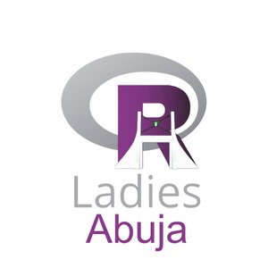

```{=html}
<script>
document.addEventListener("DOMContentLoaded", () => {
  const hero = document.querySelector(".hero-section");
  if (hero) {
    const letters = ["R", "{}", "<-", "ggplot2", "tidyverse", "|>", "dplyr", "~", "∑"];
    for (let i = 0; i < 18; i++) {
      const el = document.createElement("div");
      el.className = "floating-r";
      el.textContent = letters[i % letters.length];
      el.style.cssText = `left:${Math.random()*100}%;bottom:-${Math.random()*20}%;font-size:${Math.random()*3+1.2}rem;animation-duration:${Math.random()*20+12}s;animation-delay:${Math.random()*10}s;`;
      hero.appendChild(el);
    }
  }
  document.querySelectorAll(".reveal").forEach(el => {
    new IntersectionObserver(([e]) => { if(e.isIntersecting) e.target.classList.add("visible"); }, {threshold:.1}).observe(el);
  });
  document.querySelectorAll("[data-count]").forEach(el => {
    new IntersectionObserver(([e]) => {
      if (!e.isIntersecting) return;
      const target = +el.getAttribute("data-count");
      const suffix = el.getAttribute("data-suffix") || "";
      let cur = 0;
      const step = Math.ceil(target / 60);
      const t = setInterval(() => {
        cur = Math.min(cur + step, target);
        el.textContent = cur.toLocaleString() + suffix;
        if (cur >= target) clearInterval(t);
      }, 25);
    }, {threshold:.5}).observe(el);
  });
});
</script>

<!-- TICKER -->
<div class="ticker-wrap" aria-hidden="true">
  <div class="ticker">
    <span class="ticker-item"><span class="ticker-dot"></span> R-Ladies Abuja</span>
    <span class="ticker-item"><span class="ticker-dot"></span> 2,356 Members</span>
    <span class="ticker-item"><span class="ticker-dot"></span> 34+ Events</span>
    <span class="ticker-item"><span class="ticker-dot"></span> Abuja, Nigeria 🇳🇬</span>
    <span class="ticker-item"><span class="ticker-dot"></span> Data Science</span>
    <span class="ticker-item"><span class="ticker-dot"></span> R Programming</span>
    <span class="ticker-item"><span class="ticker-dot"></span> Open Source</span>
    <span class="ticker-item"><span class="ticker-dot"></span> AI & Machine Learning</span>
    <span class="ticker-item"><span class="ticker-dot"></span> Women in STEM</span>
    <span class="ticker-item"><span class="ticker-dot"></span> R-Ladies Global</span>
    <span class="ticker-item"><span class="ticker-dot"></span> R-Ladies Abuja</span>
    <span class="ticker-item"><span class="ticker-dot"></span> 2,356 Members</span>
    <span class="ticker-item"><span class="ticker-dot"></span> 34+ Events</span>
    <span class="ticker-item"><span class="ticker-dot"></span> Abuja, Nigeria 🇳🇬</span>
    <span class="ticker-item"><span class="ticker-dot"></span> Data Science</span>
    <span class="ticker-item"><span class="ticker-dot"></span> R Programming</span>
    <span class="ticker-item"><span class="ticker-dot"></span> Open Source</span>
    <span class="ticker-item"><span class="ticker-dot"></span> AI & Machine Learning</span>
    <span class="ticker-item"><span class="ticker-dot"></span> Women in STEM</span>
    <span class="ticker-item"><span class="ticker-dot"></span> R-Ladies Global</span>
  </div>
</div>

<!-- HERO -->
<section class="hero-section">
  <div class="hero-inner">
    <div class="hero-badge">🇳🇬 &nbsp; Part of R-Ladies Global &nbsp;·&nbsp; Abuja, FCT, Nigeria</div>
    <h1 class="hero-title">Where <span class="highlight">Women</span><br>Master the Art of <span class="highlight">R</span></h1>
    <p class="hero-subtitle">A vibrant community of R users, data scientists, and AI enthusiasts in Abuja — learning together, growing together, and breaking barriers in STEM.</p>
    <div class="hero-buttons">
      <a href="https://www.meetup.com/rladies-abuja/" target="_blank" class="btn-rladies">🚀 Join on Meetup</a>
      <a href="events.html" class="btn-outline-rladies">📅 View Events</a>
    </div>
    <div class="hero-stats">
      <div class="stat-item"><span class="stat-number" data-count="2356">2356</span><span class="stat-label">Members</span></div>
      <div class="stat-item"><span class="stat-number" data-count="34">34</span><span class="stat-label">Events Hosted</span></div>
      <div class="stat-item"><span class="stat-number" data-count="4" data-suffix=".6 ⭐">4.6 ⭐</span><span class="stat-label">Community Rating</span></div>
      <div class="stat-item"><span class="stat-number" data-count="2021">2021</span><span class="stat-label">Founded</span></div>
    </div>
  </div>
</section>

<!-- ABOUT -->
<section class="section section-soft" style="padding:5rem 1.5rem;">
  <div style="max-width:1100px;margin:0 auto;">
    <div class="row align-items-center g-5">
      <div class="col-lg-5 reveal">
        <div style="position:relative;display:flex;justify-content:center;">
          <div style="width:280px;height:280px;border-radius:50%;background:linear-gradient(135deg,#88398A,#F4A261);display:flex;align-items:center;justify-content:center;box-shadow:0 20px 60px rgba(136,57,138,.3);">
            <!-- FIX: logo path must be images/logo.jpg and loaded via a proper img tag -->
            
            <div style="display:none;width:220px;height:220px;border-radius:50%;background:white;align-items:center;justify-content:center;border:6px solid white;font-family:'Fraunces',serif;font-size:5rem;font-weight:900;color:#88398A;">R</div>
          </div>
          <div style="position:absolute;top:-10px;right:20px;width:55px;height:55px;border-radius:50%;background:#F4A261;opacity:.3;"></div>
          <div style="position:absolute;bottom:0;left:10px;width:38px;height:38px;border-radius:50%;background:#2A9D8F;opacity:.4;"></div>
        </div>
      </div>
      <div class="col-lg-7 reveal">
        <span class="section-eyebrow" style="background:#f3e8f4;color:#88398A;font-size:.7rem;font-weight:800;letter-spacing:.15em;text-transform:uppercase;padding:.35rem 1rem;border-radius:100px;display:inline-block;margin-bottom:1rem;">Who We Are</span>
        <h2 style="font-size:1.9rem;font-family:'Fraunces',serif;color:#5c1a5e;margin-bottom:1rem;">More than a meetup.<br><em>A movement.</em></h2>
        <p style="font-size:.92rem;color:#555;line-height:1.7;margin-bottom:1.2rem;">R-Ladies Abuja is a local chapter of <a href="https://rladies.org" style="color:#88398A;font-weight:600;">R-Ladies Global</a> — a worldwide organisation dedicated to increasing gender diversity in the R community. Based in Abuja, FCT, Nigeria, we unite data enthusiasts, statisticians, developers, and curious learners under one roof.</p>
        <p style="font-size:.92rem;color:#555;line-height:1.7;margin-bottom:2rem;">From interactive workshops to deep-dive talks on ggplot2, tidyverse, machine learning, and beyond — we create safe, welcoming spaces for everyone to grow their R skills and forge meaningful connections in the data world.</p>
        <div class="location-badge">📍 &nbsp; Abuja, Federal Capital Territory, Nigeria</div><br>
        <a href="about.html" class="btn-purple" style="margin-top:.75rem;">Learn More About Us →</a>
      </div>
    </div>
  </div>
</section>

<!-- VALUES — single row using flexbox -->
<section class="section section-light" style="padding:5rem 1.5rem;">
  <div style="max-width:1100px;margin:0 auto;">
    <div class="section-header reveal">
      <span class="section-eyebrow">Our Values</span>
      <h2>What Drives Us</h2>
      <p>Four pillars that shape every event, workshop, and conversation in our community.</p>
    </div>
    <div class="pillars-row stagger">
      <div class="reveal">
        <div class="pillar-card pillar-1"><span class="pillar-icon">🎓</span><h3>Education First</h3><p>Hands-on workshops, tutorials, and talks designed for all levels — beginner to advanced.</p></div>
      </div>
      <div class="reveal">
        <div class="pillar-card pillar-2"><span class="pillar-icon">🤝</span><h3>Inclusive Community</h3><p>A safe space for all gender minorities in the R & data science ecosystem across Nigeria.</p></div>
      </div>
      <div class="reveal">
        <div class="pillar-card pillar-3"><span class="pillar-icon">🌍</span><h3>Global Connections</h3><p>Part of a worldwide network of 250+ R-Ladies chapters spanning every continent.</p></div>
      </div>
      <div class="reveal">
        <div class="pillar-card pillar-4"><span class="pillar-icon">🚀</span><h3>Career Growth</h3><p>Mentorship, collaboration, and networking to accelerate STEM careers for our members.</p></div>
      </div>
    </div>
  </div>
</section>

<!-- RECENT EVENTS — single row -->
<section class="section section-soft" style="padding:5rem 1.5rem;">
  <div style="max-width:1100px;margin:0 auto;">
    <div class="section-header reveal">
      <span class="section-eyebrow">Community Events</span>
      <h2>What We've Been Up To</h2>
      <p>From ggplot2 masterclasses to cutting-edge AI workshops — every meetup sparks something new.</p>
    </div>
    <div class="events-row stagger">
      <div class="reveal">
        <div class="event-card">
          <div class="event-date">📅 March 25, 2026</div>
          <h3>Uncharted Waters: Learnings and Best Tricks from Developing a ggplot2 Data Visualization Masterclass</h3>
          <p style="font-size:.85rem;color:#777;margin-bottom:1rem;">An in-depth dive into advanced ggplot2 techniques, themes, and customisation for publication-ready charts.</p>
          <div class="d-flex align-items-center justify-content-between">
            <span class="attendee-badge">👥 67 attendees</span>
            <a href="https://www.meetup.com/rladies-abuja/events/313505524/" target="_blank" style="font-size:.78rem;color:#88398A;font-weight:600;text-decoration:none;">View →</a>
          </div>
        </div>
      </div>
      <div class="reveal">
        <div class="event-card">
          <div class="event-date">📅 Feb 25, 2026</div>
          <h3>Outgrowing Your Laptop with R and Positron</h3>
          <p style="font-size:.85rem;color:#777;margin-bottom:1rem;">Exploring cloud computing, Posit Workbench, and the new Positron IDE for scalable R workflows.</p>
          <div class="d-flex align-items-center justify-content-between">
            <span class="attendee-badge">👥 51 attendees</span>
            <a href="https://www.meetup.com/rladies-abuja/events/312978180/" target="_blank" style="font-size:.78rem;color:#88398A;font-weight:600;text-decoration:none;">View →</a>
          </div>
        </div>
      </div>
      <div class="reveal">
        <div class="event-card">
          <div class="event-date">📅 Oct 25, 2025</div>
          <h3>Coding Against Cancer: R for Breast Cancer Detection</h3>
          <p style="font-size:.85rem;color:#777;margin-bottom:1rem;">Using R to analyse anthropometric data and build models for early breast cancer detection.</p>
          <div class="d-flex align-items-center justify-content-between">
            <span class="attendee-badge">👥 15 attendees</span>
            <a href="https://www.meetup.com/rladies-abuja/events/311516936/" target="_blank" style="font-size:.78rem;color:#88398A;font-weight:600;text-decoration:none;">View →</a>
          </div>
        </div>
      </div>
      <div class="reveal">
        <div class="event-card">
          <div class="event-date">📅 Sep 17, 2025</div>
          <h3>Easy Code-based Data Visualization with tidyplots</h3>
          <p style="font-size:.85rem;color:#777;margin-bottom:1rem;">An introduction to the tidyplots package — elegant, reproducible plots with minimal code.</p>
          <div class="d-flex align-items-center justify-content-between">
            <span class="attendee-badge">👥 29 attendees</span>
            <a href="https://www.meetup.com/rladies-abuja/events/310910580/" target="_blank" style="font-size:.78rem;color:#88398A;font-weight:600;text-decoration:none;">View →</a>
          </div>
        </div>
      </div>
    </div>
    <div style="text-align:center;margin-top:2.5rem;" class="reveal">
      <a href="events.html" class="btn-purple">See All 34 Events →</a>
    </div>
  </div>
</section>

<!-- YOUTUBE SECTION — fixed embed -->
<section class="section section-dark" style="padding:5rem 1.5rem;">
  <div style="max-width:1100px;margin:0 auto;">
    <div class="section-header reveal">
      <span class="section-eyebrow" style="background:rgba(255,255,255,.15);color:#F4A261;">Watch & Learn</span>
      <h2 style="color:white;">Talks, Tutorials & Webinars</h2>
      <p style="color:rgba(255,255,255,.7);">All our sessions are recorded and freely available on our YouTube channel. Learn at your own pace.</p>
    </div>
    <div class="row g-4 stagger">
      <!-- FIX: use correct YouTube playlist embed for channel UCktFo5XoX5QZMWb2Gb3KY2A -->
      <div class="col-lg-7 reveal">
        <div style="border-radius:14px;overflow:hidden;box-shadow:0 16px 50px rgba(0,0,0,.5);">
          <div class="video-thumb">
            <iframe
              src="https://www.youtube.com/embed/videoseries?list=UUktFo5XoX5QZMWb2Gb3KY2A&rel=0&modestbranding=1"
              title="R-Ladies Abuja — All Talks"
              allow="accelerometer; autoplay; clipboard-write; encrypted-media; gyroscope; picture-in-picture; web-share"
              allowfullscreen>
            </iframe>
          </div>
        </div>
      </div>
      <div class="col-lg-5 reveal">
        <div style="display:flex;flex-direction:column;gap:.75rem;height:100%;justify-content:center;">
          <div style="background:rgba(255,255,255,.06);border:1px solid rgba(255,255,255,.1);border-radius:12px;padding:1rem 1.25rem;">
            <div style="font-size:.68rem;font-weight:700;text-transform:uppercase;letter-spacing:.1em;color:#F4A261;margin-bottom:.35rem;">📊 Data Visualisation</div>
            <div style="font-size:.88rem;font-weight:600;color:white;">ggplot2 & tidyplots Deep Dives</div>
          </div>
          <div style="background:rgba(255,255,255,.06);border:1px solid rgba(255,255,255,.1);border-radius:12px;padding:1rem 1.25rem;">
            <div style="font-size:.68rem;font-weight:700;text-transform:uppercase;letter-spacing:.1em;color:#F4A261;margin-bottom:.35rem;">🤖 Machine Learning & AI</div>
            <div style="font-size:.88rem;font-weight:600;color:white;">ML & AI with R Workshops</div>
          </div>
          <div style="background:rgba(255,255,255,.06);border:1px solid rgba(255,255,255,.1);border-radius:12px;padding:1rem 1.25rem;">
            <div style="font-size:.68rem;font-weight:700;text-transform:uppercase;letter-spacing:.1em;color:#F4A261;margin-bottom:.35rem;">🔬 Applied Data Science</div>
            <div style="font-size:.88rem;font-weight:600;color:white;">Real-World Case Studies</div>
          </div>
          <div style="background:rgba(255,255,255,.06);border:1px solid rgba(255,255,255,.1);border-radius:12px;padding:1rem 1.25rem;">
            <div style="font-size:.68rem;font-weight:700;text-transform:uppercase;letter-spacing:.1em;color:#F4A261;margin-bottom:.35rem;">☁️ Cloud & Scaling</div>
            <div style="font-size:.88rem;font-weight:600;color:white;">Positron, Posit Cloud & More</div>
          </div>
          <a href="https://www.youtube.com/@r-ladiesabuja/videos" target="_blank" class="btn-rladies" style="text-align:center;margin-top:.5rem;">▶ Visit Our Channel</a>
        </div>
      </div>
    </div>
    <div style="text-align:center;margin-top:2.5rem;" class="reveal">
      <a href="talks.html" class="btn-outline-rladies">📺 Explore All Talks →</a>
    </div>
  </div>
</section>

<!-- SPONSORS — single row -->
<section class="section section-light" style="padding:4rem 1.5rem;">
  <div style="max-width:900px;margin:0 auto;text-align:center;">
    <div class="reveal" style="margin-bottom:2rem;">
      <span class="section-eyebrow">Proudly Supported By</span>
      <h2 style="font-size:1.8rem;margin-top:.5rem;">Our Sponsors</h2>
    </div>
    <div class="sponsors-row reveal stagger">
      <a href="https://r-consortium.org/" target="_blank" class="sponsor-logo">🏛️ &nbsp; R Consortium</a>
      <a href="https://rladies.org" target="_blank" class="sponsor-logo">💜 &nbsp; R-Ladies Global</a>
      <a href="https://www.business-datalab.com" target="_blank" class="sponsor-logo">📊 &nbsp; Business Data Laboratory</a>
      <a href="https://linuxfoundation.org/" target="_blank" class="sponsor-logo">🐧 &nbsp; Linux Foundation</a>
    </div>
  </div>
</section>

<!-- JOIN CTA -->
<section class="section section-soft" style="padding:5rem 1.5rem;">
  <div style="max-width:900px;margin:0 auto;" class="reveal">
    <div class="join-cta">
      <span style="font-size:2.5rem;display:block;margin-bottom:1rem;">✨</span>
      <h2>Ready to Join the Movement?</h2>
      <p>Whether you're an absolute beginner or a seasoned data scientist, there's a place for you in R-Ladies Abuja. Join over 2,356 members and start your journey today.</p>
      <div style="display:flex;gap:1rem;justify-content:center;flex-wrap:wrap;">
        <a href="https://www.meetup.com/rladies-abuja/" target="_blank" class="btn-rladies">🚀 Join on Meetup</a>
        <a href="https://www.linkedin.com/in/rladies-abuja/" target="_blank" class="btn-outline-rladies">💼 Connect on LinkedIn</a>
        <a href="https://www.youtube.com/@r-ladiesabuja/videos" target="_blank" class="btn-outline-rladies">▶ Watch on YouTube</a>
      </div>
    </div>
  </div>
</section>

<div class="flag-stripe"></div>
```
